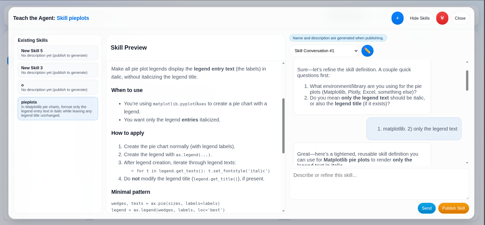

# ReportingAgent

ReportingAgent is an agentic reporting app that turns chat requests into iterative markdown reports and supports reusable shared Skills.

## UI Preview 🖼️




## Feature Purpose 🎯

- Reports: core delivery feature. A report is a persistent workspace (`report_<id>`) where chat iterations update `report.md` and generated artifacts over time.
- Skills: reusable behavior feature. Skills capture user-taught guidance once and persist it as shared `SKILL.md` instructions for worker reuse.

## Key Capabilities ✨

- Create, iterate, and delete reports from the UI.
- Persist report conversations in Postgres (`reports -> conversations -> messages`).
- Maintain shared skills with teaching chat and publish flow.
- Persist skill conversations in Postgres (`skills -> skill_conversations -> skill_messages`).
- Use backend + worker agent orchestration for report generation/refinement.
- Work with any dataset, as long as it is accessible in a PostgreSQL database.

## Architecture 🏗️

```text
Frontend (React + Vite)
  -> Backend API (FastAPI)
      -> Report chat endpoint runs main_agent (gpt-5.4-mini)
          -> tool: call worker /invoke with {query, report_id}
          -> tool: report_agent (workspace-safe report/file editing)
      -> Skills endpoints run:
          -> skill_chat_agent (gpt-5.4-nano) for teaching conversations
          -> skill_agent (gpt-5.4-nano) for publish JSON output
      -> Worker API (/invoke)
          -> code_executor_agent (gpt-5.4-mini, structured output)
          -> tools: workspace file ops, run_python, DB inspection, shared skill search/read

Postgres stores app state (reports, conversations, messages, skills, skill_conversations, skill_messages)
Shared volume stores report files under /data/shared/jobs/report_<id>/
Shared volume stores skills under /data/shared/skills/<skill_slug>/SKILL.md
```

## Repository Layout 📁

```text
backend/                 FastAPI API + main/report/skill agents
frontend/                React/Vite UI
worker/                  FastAPI worker + code executor agent
infra/postgres/          SQL schemas (app + Olist)
docs/                    Feature docs (skills, reports)
scripts/                 Kaggle download/load helpers
Makefile                 Main Docker/local workflow commands
```

## Requirements ✅

- Docker + Docker Compose
- OpenAI API key
- Optional: Kaggle credentials for Olist dataset loading
- `.env.local` for local (non-Docker) backend/worker runs

## Quick Start 🚀

1. Copy env file and set values:

```bash
cp .env.example .env
```

Minimum required variable:

```bash
OPENAI_API_KEY=sk-...
```

2. Start stack:

```bash
make up
```

3. Initialize app schema:

```bash
make db-init
```

4. Open services:

- Frontend: `http://localhost:3001`
- Backend API: `http://localhost:8000`
- Worker API: `http://localhost:5000`
- Langfuse UI: `http://localhost:3002`

## Common Make Targets 🛠️

- `make up` / `make down` / `make ps` / `make logs`
- `make stack-up` / `make stack-down` / `make stack-ps` / `make stack-logs`
- `make langfuse-up` / `make langfuse-down` / `make langfuse-ps` / `make langfuse-logs`
- `make db-init` (apply `infra/postgres/app_schema.sql`)
- `make kaggle-setup` (optional Olist setup)

Run `make help` for full list.

## API Summary 🔌

### Reports

- `GET /reports`
- `POST /reports`
- `DELETE /reports/{report_id}`
- `GET /reports/{report_id}/conversations`
- `POST /reports/{report_id}/conversations`
- `GET /conversations/{conversation_id}/messages`
- `POST /conversations/{conversation_id}/messages`
- `GET /reports/{report_id}/markdown`
- `GET /reports/{report_id}/pdf`
- `GET /reports/{report_id}/files/{file_path}`

Notes:
- Creating a report also creates its first conversation row.
- Sending a report chat message runs the backend main agent, which can call worker `/invoke` and then update `report.md`.

### Skills

- `GET /skills`
- `POST /skills`
- `DELETE /skills/{skill_id}`
- `GET /skills/{skill_id}/markdown`
- `GET /skills/{skill_id}/conversations`
- `POST /skills/{skill_id}/conversations`
- `GET /skill-conversations/{skill_conversation_id}/messages`
- `POST /skill-conversations/{skill_conversation_id}/messages`
- `POST /skills/{skill_id}/publish`

Notes:
- Creating a skill also creates its first `skill_conversation`.
- `GET /skills/{skill_id}/markdown` returns 404 until the skill has been published at least once.

### Compatibility

- `POST /agent/teach` (legacy quick-save)
- `GET /agent/skills` (legacy compatibility)

### Health

- `GET /health` (backend)
- `GET /health` (worker)

### Internal Worker

- `POST /invoke` (called by backend main agent)

## Storage & Lifecycle 🗂️

### Reports

```text
/data/shared/jobs/report_<report_id>/
  report.md
  ...generated files
```

- One report can have multiple conversations.
- Deleting a report cascades to conversations/messages.
- Workspace folder cleanup is best-effort.
- Worker-generated artifacts are typically placed in the same workspace (for example `figures/`).

### Skills (Shared)

```text
/data/shared/skills/<skill_slug>/SKILL.md
```

- `/data/shared` is backed by Docker volume `shared_data`.
- `SKILL.md` requires YAML frontmatter (`name`, `description`) and markdown instructions.
- Current implementation is intentionally basic (single markdown file per skill).
- Worker skill retrieval is keyword/frontmatter based (`search_agent_skills` + `read_agent_skill`).

## Optional: Load Olist Dataset 📊

```bash
make kaggle-prepare
make kaggle-download
make kaggle-load
```

Or run all at once:

```bash
make kaggle-setup
```

## Additional Docs 📚

- [docs/agents.md](docs/agents.md)
- [docs/reports.md](docs/reports.md)
- [docs/skills.md](docs/skills.md)

## Notes 📝

- Frontend is React + Vite.
- App schema is applied via `make db-init` using `infra/postgres/app_schema.sql`.
- `.env.local` is required for backend/worker local runs when `APP_ENV != docker`.
