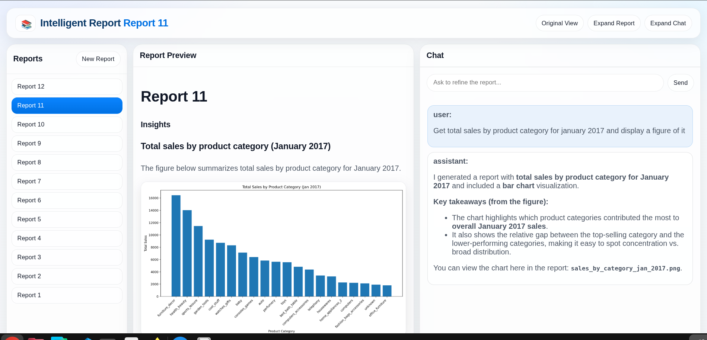

# ReportingAgent

Agentic analytics reporting system that turns chat requests into iteratively updated markdown reports.

## UI Preview 🖼️



The tool works as an iterative reporting workflow:
- You create or select a report from the left sidebar.
- You ask questions or refinement requests in chat (right panel).
- The backend agent decides how to answer, calls the worker when analysis/code execution is needed, and updates the report content.
- The report preview (center panel) reloads from `report.md`, including generated charts/tables saved in the report workspace.
- Every exchange is stored in Postgres so the report can be refined across multiple turns.

## What It Does ✨

- Lets you create reports and refine them through chat.
- Persists report conversations in Postgres.
- Uses a backend orchestration agent plus a worker agent that can inspect DB schema, write/run Python, and generate report artifacts.
- Stores each report in its own workspace directory (`report.md` + generated files).
- Optionally sends traces to a self-hosted Langfuse stack.

## Architecture 🏗️

```text
Frontend (React + Vite)
  -> Backend API (FastAPI, /reports/*)
      -> Main agent (OpenAI Agents SDK)
          -> report_agent tool (reads/updates report markdown)
          -> Worker API (/invoke)
              -> Planner agent + code executor agent
              -> Postgres inspection/query tools + Python execution

Postgres stores app state (reports, conversations, messages)
Shared volume stores per-report files under /data/shared/jobs/report_<id>/
```

## Repository Layout 📁

```text
backend/                 FastAPI API + main orchestration agent
frontend/                React/Vite UI
worker/                  FastAPI worker + planning/execution agents
infra/postgres/          SQL schemas (app + Olist)
scripts/                 Kaggle download/load helpers
Makefile                 Main entrypoints for local Docker workflows
```

## Requirements ✅

- Docker + Docker Compose
- OpenAI API key
- (Optional) Kaggle credentials to load the Olist dataset
- `.env.local` for local (non-Docker) backend/worker testing

## Quick Start 🚀

1. Copy environment file and fill the required values:

```bash
cp .env.example .env
```

Minimum required variable:

```bash
OPENAI_API_KEY=sk-...
```

2. Start full stack (app + Langfuse):

```bash
make up
```

3. Initialize app schema (reports/conversations/messages):

```bash
make db-init
```

4. Open services:

- Frontend: `http://localhost:3001`
- Backend API: `http://localhost:8000`
- Worker API: `http://localhost:5000`
- Langfuse UI: `http://localhost:3002`

## Make Targets 🛠️

Use `make help` to print all targets.

Common targets:

- `make up` / `make down` / `make ps` / `make logs` (app + Langfuse)
- `make stack-up` / `make stack-down` (app stack only)
- `make langfuse-up` / `make langfuse-down` (Langfuse only)
- `make db-init` (apply `infra/postgres/app_schema.sql`)

## Load Olist Dataset (Optional) 📊

The worker can inspect/query whatever is in Postgres. To load the Olist ecommerce dataset:

1. Configure Kaggle auth (`KAGGLE_USERNAME` + `KAGGLE_KEY`, or `~/.kaggle/kaggle.json`).
2. Run:

```bash
make kaggle-setup
```

Equivalent step-by-step:

```bash
make kaggle-prepare
make kaggle-download
make kaggle-load
```

This applies `infra/postgres/olist_schema.sql` and loads CSVs into `olist_*` tables.

## Local Testing (Without Docker) 🧪

For backend/worker local testing, create `.env.local` in the repository root.  
This is required because both services load `.env.local` when `APP_ENV != docker`.

## Core API Endpoints 🔌

Backend (`:8000`):

- `GET /health`
- `GET /reports`
- `POST /reports`
- `GET /reports/{report_id}/messages`
- `POST /reports/{report_id}/messages`
- `GET /reports/{report_id}/markdown`
- `GET /reports/{report_id}/files/{file_path}`
- `POST /agent/teach` (creates shared main-agent skills from UI requests)

Worker (`:5000`):

- `GET /health`
- `POST /invoke`

## Report Workspaces 🗂️

Each report gets a workspace folder:

```text
/data/shared/jobs/report_<report_id>/
  report.md
  ...generated files (images, scripts, outputs)
```

Images/files can be referenced from markdown through backend file routes, for example:

```md

```

## Observability 👀

Langfuse instrumentation is enabled in backend and worker on startup. Set `LANGFUSE_*` variables in `.env` if you want traces persisted in the self-hosted Langfuse stack.

## Notes 📝

- Current frontend is React + Vite (not Next.js).
- Compose services install dependencies on container startup (`pip install` / `npm install`) for development convenience.
- `infra/postgres/init.sql` is currently a placeholder; app schema is applied via `make db-init`.
- `.env.local` is required when running backend/worker outside Docker (the code loads it when `APP_ENV != docker`).
