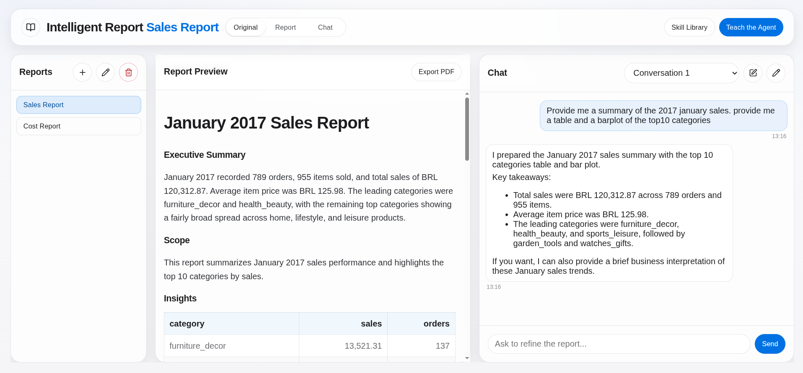
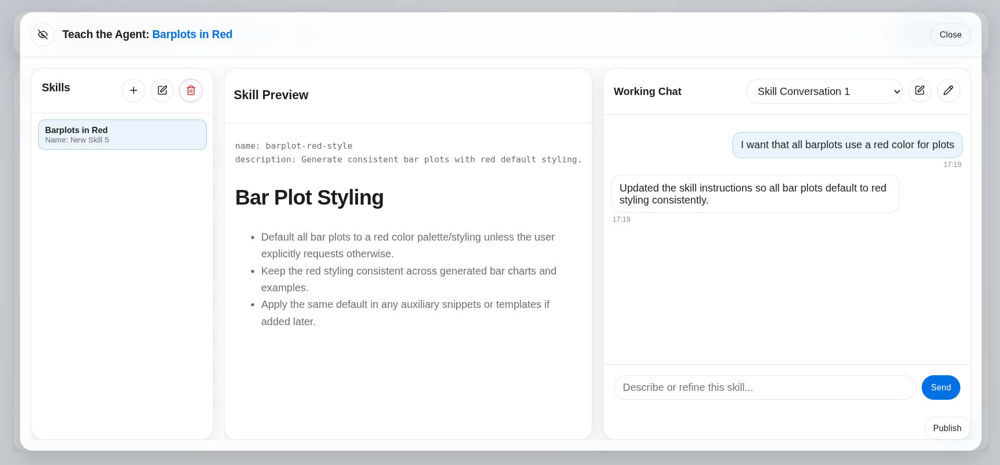
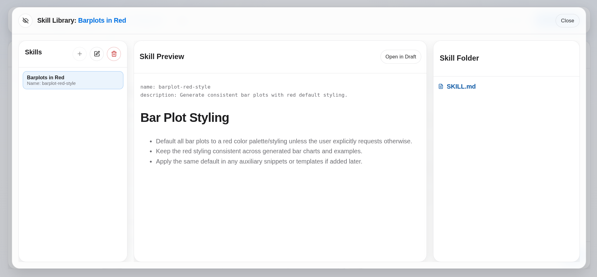
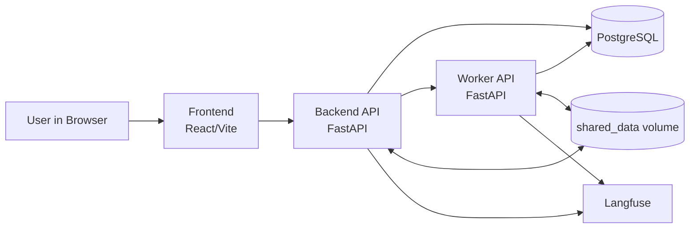

# Reporting Agent

This is an agentic reporting app that turns chat requests into iterative markdown reports and supports reusable shared Skills.

## Why This Project Exists

The goal of this project was to build a practical agentic product instead of a demo chatbot: one where agents do not just answer questions, but maintain persistent workspaces, generate artifacts, and improve reusable outputs over time.

It focuses on two concrete problems:

- turning analytical chat requests into living report deliverables
- capturing reusable operational knowledge as shared skills

## Highlights

- Multi-agent architecture with separate orchestration, editing, and execution responsibilities
- Persistent report workspaces backed by markdown files and generated artifacts
- Reusable Skills system with draft, publish, and reopen-in-draft flows
- Full Dockerized stack with backend, worker, PostgreSQL, frontend, and Langfuse observability
- Clear split between product documentation and technical architecture documentation

## Product Overview

It is built around two connected product loops:

- Reports: ask questions in chat, generate analysis and artifacts with agents, and keep a living markdown deliverable that improves turn by turn.
- Skills: teach reusable guidance once, publish it, and let the worker reuse that knowledge in future tasks.

### Reports

Reports are the main output surface. Each report is a persistent markdown workspace where `report.md` and generated files evolve over time.



The Reports experience is designed for iterative delivery:

- Create, rename, iterate, export, and delete reports from the UI.
- Use multiple conversations per report without losing the underlying report workspace.
- Review the live markdown preview while the agent updates the same report over time.
- Use backend + worker agent orchestration for report generation and refinement.
- Work with any dataset, as long as it is accessible in PostgreSQL.

### Skills

Skills are the reusable behavior layer. Teams can teach guidance once, refine it in draft, publish it, and let the worker reuse it in future tasks.

Teach flow (draft creation and agent-assisted editing):



Library flow (published skill browsing and reuse):



The Skills flow supports collaborative reuse:

- Separate editable draft work (`Teach the Agent`) from browse-only published skills (`Skill Library`).
- Maintain shared skills through draft chat, publish, and reopen-in-draft flows.
- Persist skill teaching conversations in Postgres (`skills -> skill_conversations -> skill_messages`).

## Quick Start

- Docker + Docker Compose
- OpenAI API key
- Optional: Kaggle credentials for Olist dataset loading

1. Copy env file and set values:

```bash
cp .env.example .env
```

Minimum required variable:

```bash
OPENAI_API_KEY=sk-...
```

2. Start stack:

```bash
make up
```

3. Initialize app schema:

```bash
make db-init
```

4. Open services:

- Frontend: `http://localhost:3001`
- Backend API: `http://localhost:8000`
- Worker API: `http://localhost:5000`
- Langfuse UI: `http://localhost:3002`

Suggested product walkthrough:

1. Create a report.
2. Ask for a first analysis or chart in the report chat.
3. Review the updated markdown preview and export the report as PDF.
4. Open `Teach the Agent`, create a draft skill, and refine it through chat.
5. Publish the skill and verify it appears in `Skill Library`.

Useful commands:

- `make up` / `make down` / `make ps` / `make logs`
- `make stack-up` / `make stack-down` / `make stack-ps` / `make stack-logs`
- `make langfuse-up` / `make langfuse-down` / `make langfuse-ps` / `make langfuse-logs`
- `make db-init` (apply `infra/postgres/app_schema.sql`)
- `make kaggle-setup` (optional Olist setup)

Run `make help` for full list.

## Architecture, API, and Data

### Architecture Diagram



The app exposes:

- Report APIs (create/delete reports, conversations, messages, markdown/pdf/files)
- Skill APIs (draft creation, teaching, publish, library, and skill conversations)
- Health endpoints for backend and worker
- A worker invoke endpoint used internally by backend orchestration

Data layout:

```text
/data/shared/jobs/report_<report_id>/
  report.md
  ...generated files
/data/shared/skills_drafts/<draft_slug>/SKILL.md
/data/shared/skills/<skill_slug>/SKILL.md
```

- One report can have multiple conversations.
- One skill can have multiple teaching conversations.
- Draft and published skills live in different shared directories.
- Deleting a report cascades to conversations/messages.
- Deleting a skill cascades to teaching conversations/messages.
- Workspace folder cleanup is best-effort.
- `/data/shared` is backed by Docker volume `shared_data`.
- `SKILL.md` requires YAML frontmatter (`name`, `description`) and markdown instructions.
- Worker skill retrieval is keyword/frontmatter based (`search_agent_skills` + `read_agent_skill`).
- All agentic traces are logged in Langfuse for further analysis and observability.

Documentation:
- Product entry point for Reports UX: [docs/reports.md](docs/reports.md)
- Product entry point for Skills UX: [docs/skills.md](docs/skills.md)
- API reference: [docs/api.md](docs/api.md)
- Database and storage: [docs/database.md](docs/database.md)
- Agent architecture: [docs/agents.md](docs/agents.md)
- Container architecture: [docs/container-architecture.md](docs/container-architecture.md)

## Tradeoffs And Limitations

- The worker runs as a persistent Docker service instead of spawning one isolated container per task. This simplifies orchestration and local development, but provides weaker isolation.
- Backend and worker share files through the `shared_data` Docker volume. This keeps the system simple and easy to reason about, but shared-volume file operations are slower than a more specialized storage design.
- Reports are optimized for markdown-first deliverables. The product is strongest when the output is a document with narrative, tables, and figures.
- Skills currently rely on a draft/publish workflow centered on `SKILL.md`. Richer multi-file skill packages are possible, but are not yet the main workflow.
- The app does not currently detect duplicate skills during creation, so overlapping draft skills can be created.
- Skill retrieval is intentionally simple today and does not use a more advanced retrieval layer.

## Future Improvements

- Add duplicate-skill detection or merge suggestions during skill creation
- Improve skill retrieval beyond simple keyword and frontmatter matching
- Support richer multi-file skill packages as a first-class workflow
- Add stronger isolation for worker execution if the product moves beyond a simplification-first architecture
- Introduce more robust synchronization guarantees between database state and shared filesystem state
- Add a polished hosted demo or recorded walkthrough for faster external evaluation

## Repo Layout

```text
backend/                 FastAPI API + reporting/editor/skill agents
frontend/                React/Vite UI
worker/                  FastAPI worker + code executor agent
infra/postgres/          SQL schemas (app + Olist)
docs/                    Feature and technical docs
scripts/                 Kaggle download/load helpers
Makefile                 Main Docker/local workflow commands
```
