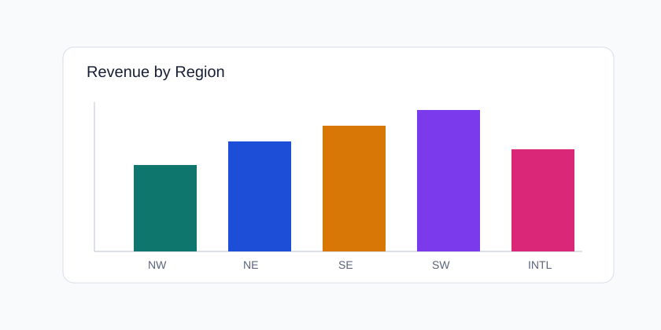

# Sales Performance Summary

This report summarizes sales metrics for the latest cycle.

## Highlights

- Revenue increased by **12%** compared to last month.
- Delayed deliveries fell by **8%** after logistics adjustments.
- Top-performing region: **Northwest**.

## Visual Snapshot

## Next Iteration Ideas

- Add state-level variance analysis.
- Compare premium vs standard customer segments.
- Include churn and reactivation cohorts.
